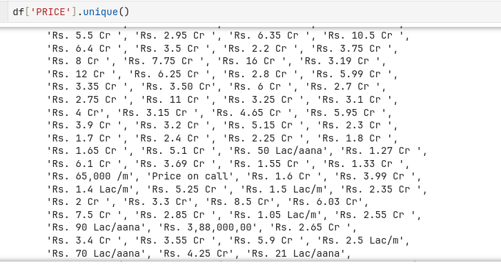
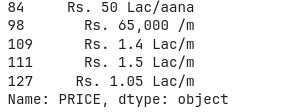
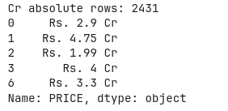
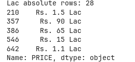
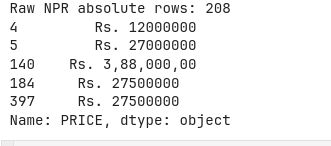
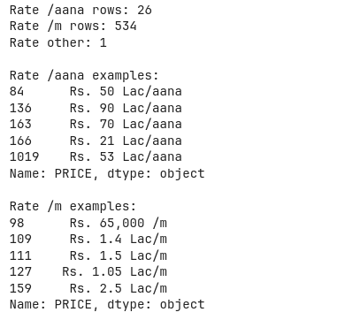
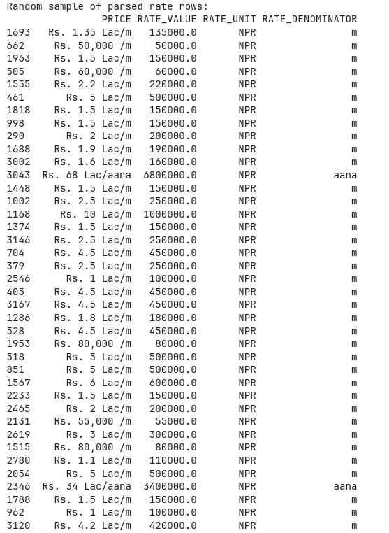

# EDA_Housing_Prices_in_Nepal

# Documentation: Phase 1 - Price Data Cleaning 

## Overview

This document describes the first phase of Exploratory Data Analysis (EDA) and Feature Engineering for the Nepali House Price Dataset. The primary challenge addressed was cleaning and standardizing the highly inconsistent `PRICE` column, which contained multiple formats, units, and placeholders.

---

## The Problem

The original `PRICE` column had several issues:


| Issue Type | Example Values | Count |
|------------|----------------|-------|
| Placeholder text | `"Price on call"`, `"contact"`, `"negotiable"` | 190 |
| Price per unit (rates) | `"Rs. 1.5 Lac/m"`, `"Rs. 50 Lac/aana"`, `"Rs. 65,000 /m"` | 560 |
| Absolute values in Crore | `"Rs. 2.9 Cr"`, `"Rs. 4.75 Cr"` | 2,431 |
| Absolute values in Lac | `"Rs. 1.5 Lac"`, `"Rs. 90 Lac"` | 28 |
| Raw NPR with commas | `"Rs. 12000000"`, `"Rs. 3,88,000,00"` | 208 |

**Total rows:** 3,418

---

## Step-by-Step Cleaning Process

### Step 1: Data Preparation

Created a clean copy and standardized the price column by stripping whitespace:

```python
df['PRICE_CLEAN'] = df['PRICE'].astype(str).str.strip()
```

---

### Step 2: Classification Strategy

Before converting values, all rows were classified into mutually exclusive categories:

```
                    ┌─────────────────┐
                    │   PRICE Column   │
                    └────────┬────────┘
                             │
            ┌────────────────┼────────────────┐
            ▼                ▼                ▼
    ┌───────────────┐ ┌─────────────┐ ┌─────────────┐
    │ "call/contact"│ │ Contains "/"│ │ No "/"      │
    │ (Placeholder) │ │ (Rate/unit) │ │ (Absolute)  │
    └───────────────┘ └──────┬──────┘ └──────┬──────┘
                             │               │
                             ▼               ▼
                    ┌────────────┐    ┌─────────────┐
                    │ /m or /aana│    │ Has "Cr"    │
                    └────────────┘    │ Has "Lac"   │
                                      │ Raw NPR     │
                                      └─────────────┘


```








---

### Step 3: Handling Non-Price Rows

**Goal:** Identify and separate rows that don't contain actual prices.


```python
non_price_mask = df['PRICE_CLEAN'].str.contains('call|contact|negotiable', na=False, case=False)
```

**Result:** 190 rows marked as non-price (to be excluded from price analysis)

---

### Step 4: Handling Rate Prices (Per Unit)

**What are rate prices?** These indicate price per unit of land area (per meter or per aana).

**Examples:**
- `"Rs. 1.5 Lac/m"` → NPR 150,000 per square meter
- `"Rs. 50 Lac/aana"` → NPR 5,000,000 per aana
- `"Rs. 65,000 /m"` → NPR 65,000 per square meter

**Classification breakdown:**

| Denominator | Count | Example |
|-------------|-------|---------|
| `/m` (per meter) | 534 | `"Rs. 1.4 Lac/m"` |
| `/aana` (per aana) | 26 | `"Rs. 50 Lac/aana"` |
| Other | 1 | `"Rs. 50 /sf"` (per square foot) |


**Conversion Logic:**

```python
# For "/m" with "Lac" → Multiply by 100,000
# For "/m" without "Lac" → Remove commas, convert to float
# For "/aana" → Always multiply by 100,000
```

**New features created:**
- `RATE_VALUE`: Numeric rate amount (in NPR)
- `RATE_UNIT`: Unit of the rate (always 'NPR' after conversion)
- `RATE_DENOMINATOR`: Area unit ('m' or 'aana')

---

### Step 5: Handling Absolute Prices in Crore (Cr)

**Format:** `"Rs. X Cr"` or `"Rs. X.X Cr"`

**Conversion:** Multiply by 10,000,000 (1 Crore = 10,000,000 NPR)

| Original | Extracted Number | NPR Value |
|----------|-----------------|-----------|
| `Rs. 2.9 Cr` | 2.9 | 29,000,000 |
| `Rs. 4.75 Cr` | 4.75 | 47,500,000 |
| `Rs. 1.99 Cr` | 1.99 | 19,900,000 |

**Count:** 2,431 rows


---

### Step 6: Handling Absolute Prices in Lac

**Format:** `"Rs. X Lac"` or `"Rs. X.X Lac"`

**Conversion:** Multiply by 100,000 (1 Lac = 100,000 NPR)

| Original | Extracted Number | NPR Value |
|----------|-----------------|-----------|
| `Rs. 1.5 Lac` | 1.5 | 150,000 |
| `Rs. 90 Lac` | 90 | 9,000,000 |
| `Rs. 65 Lac` | 65 | 6,500,000 |

**Count:** 28 rows

---

### Step 7: Handling Raw NPR Values

**Format:** Direct NPR amounts, sometimes with commas

**Examples:**
- `"Rs. 12000000"` → 12,000,000
- `"Rs. 3,88,000,00"` → 3,880,0000 (Nepali comma system)

**Processing:** Remove commas and convert to float

**Count:** 208 rows

---

## Final Data Verification

### Classification Complete Check

```
Total rows in original: 3,418
Total rows classified: 3,418
Difference: 0 ✓
```

### Data Types After Conversion

| Column             | Type    | Non-Null Count |
| ------------------ | ------- | -------------- |
| `PRICE_NPR`        | float64 | 2,459          |
| `RATE_VALUE`       | float64 | 560            |
| `RATE_UNIT`        | object  | 560            |
| `RATE_DENOMINATOR` | object  | 560            |

---

## New Features Created

| Feature Name | Description | Use Case |
|--------------|-------------|----------|
| `PRICE_NPR` | Standardized absolute price in NPR | Primary target variable for price prediction |
| `RATE_VALUE` | Price per unit area (NPR) | For properties where only rate is available |
| `RATE_UNIT` | Currency unit (always NPR) | Metadata for rate values |
| `RATE_DENOMINATOR` | Area unit ('m' or 'aana') | Needed to calculate absolute price × land area |

---

## Summary

| Metric | Before | After |
|--------|--------|-------|
| Price formats | 5+ inconsistent formats | 1 standardized format (NPR) |
| Data types | Object (string) | Float64 (numeric) |
| Missing/placeholder rows | 190 | Identified and separated |
| New features | 0 | 4 (PRICE_NPR, RATE_VALUE, RATE_UNIT, RATE_DENOMINATOR) |

The price column is now **analysis-ready** for visualization, statistical analysis, but more columns to fix.


# Documentation: Phase 2 - Land Area, Buildup Area & Road Access Cleaning


## The Problems

### LAND AREA Column Issues

The original `LAND AREA` column contained multiple units and formats:

| Unit Type | Count | Example |
|-----------|-------|---------|
| Aana | 3,251 | `"4.0 aana"` |
| Kattha | 39 | `"0.14 kattha"` |
| Sq. Ft | 33 | `"2700 sq. ft"` |
| Sq. Mtr | 3 | `"127 sq. mtr"` |
| No unit | 3 | `"9.25"` |
| Missing | 89 | `None` |

**Total rows with land area:** 3,329 out of 3,418

### BUILDUP AREA Column Issues

| Problem | Examples |
|---------|----------|
| Multiple spellings | `"Sq. Ft."`, `"Sq. Feet"`, `"sq.ft"`, `"Sq ft"` |
| Negative values | `"-1 Sq. Ft."` (22 rows) |
| Zero values | `"0 Sq. Ft."`, `"0 Sq. Meter"` (34 rows) |
| Different units | `"Sq. Meter"`, `"Ropani"`, `"Aana"`, `"Acres"` |
| Weird formats | `"2600+1600 Sq. Feet"` (multiple values) |
| Just numbers | `"5"`, `"3210"`, `"1530"` (no unit) |
| Complex Ropani format | `"0-3-2-0 Ropani-aana-Paisa-Daam"` |

**Total rows with buildup area:** 719 out of 3,418 (only 21% have data)

### ROAD ACCESS Column Issues

| Problem | Examples |
|---------|----------|
| Ranges | `"13-20 Feet"`, `"10-12 Feet"`, `"12-18 Feet"` |
| Slash formats | `"12/20 Feet"`, `"10/13 Feet"` |
| Mixed units | `"9 Meter"`, `"20 Meter"`, `"22 meteRs."` |
| Just numbers | `"20"`, `"13"`, `"10"` (no unit) |
| Typos | `"12Feet"`, `"22  Feet"` (extra spaces) |
| Zero | `"0 Feet"` |

**Total rows with road access:** 3,409 out of 3,418

---

## Step-by-Step Cleaning Process

### Step 1: LAND AREA - Understanding the Units

First, identified all unique units present in the column:

```python
df['LAND AREA'].unique()
```

**Unit distribution found:**
- Aana (3,251 rows) - Primary unit
- Kattha (39 rows) - 1 kattha = 20 aana
- Sq. Ft (33 rows) - Need conversion
- Sq. Mtr (3 rows) - Need conversion
- No unit (3 rows) - Data errors
- Missing (89 rows)

---

### Step 2: LAND AREA - Fixing Data Errors

Found and fixed problematic entries:

| Problem | Example | Fix |
|---------|---------|-----|
| Double decimals | `"14.4.0 aana"` | Extracted first decimal only |
| No unit | `"9.25"` | Set to NaN (couldn't determine unit) |

---

### Step 3: LAND AREA - Conversion to Standard Unit (Aana)

Created conversion factors for all units:

```python
# Conversion to Aana (standard unit)
# 1 Kattha = 20 Aana
# 1 Sq. Ft = 1/342.25 Aana
# 1 Sq. Mtr = 10.764/342.25 Aana
```

**New feature created:** `LAND_AREA_AANA` (float64)

| Original | Converted to Aana |
|----------|-------------------|
| `4.0 aana` | 4.00 aana |
| `0.14 kattha` | 2.80 aana |
| `2700 sq. ft` | 7.89 aana |
| `127 sq. mtr` | 3.99 aana |

---

### Step 4: LAND AREA - Verification

```
LAND AREA IN AANA - SUMMARY
Total rows with land area: 3,329
Min: 0.00 aana
Max: 2233.81 aana (data error - fixed)
Mean: 8.00 aana
Median: 4.20 aana

Properties > 50 aana: 34 (commercial)
Properties > 100 aana: 13 (commercial)
```

**Note:** One extreme outlier (2233.81 aana) was identified as a data error (`"2233.81 sq aana"` - invalid unit) and set to NaN.

---

### Step 5: BUILDUP AREA - Understanding the Scope

```python
print(df['BUILDUP AREA'].value_counts())
```

**Unit distribution:**
- Sq. Ft/Feet: 1,090 entries (but only 719 non-null rows due to multiple spellings)
- Sq. Meter: 26 entries
- Ropani: 20 entries
- Aana: 23 entries
- Acres: 1 entry

**Invalid data found:**
- Negative values: 22 rows (`"-1 Sq. Ft."`)
- Zero values: 34 rows (`"0 Sq. Ft."`, `"0 Sq. Meter"`)
- Multiple values: 1 row (`"2600+1600 Sq. Feet"`)

---

### Step 6: BUILDUP AREA - Conversion to Standard Unit (Sq. Ft)

**Conversion factors used:**

| Original Unit | Conversion to Sq. Ft |
|---------------|---------------------|
| Sq. Ft | × 1 |
| Sq. Meter | × 10.764 |
| Aana | × 342.25 |
| Ropani | × 342.25 × 64 (complex parsing) |
| Acres | × 43,560 |

**Special handling for Ropani format:**
```python
# Format: "0-3-2-0 Ropani-aana-Paisa-Daam"
# Ropani-Aana-Paisa-Daam
# 1 Ropani = 64 Aana, 1 Aana = 4 Paisa, 1 Paisa = 4 Daam
total_aana = (ropani × 64) + aana + (paisa / 4) + (daam / 16)
sq_ft = total_aana × 342.25
```

**New feature created:** `BUILDUP_AREA_SQFT` (float64)

---

### Step 7: BUILDUP AREA - Results

```
BUILDUP AREA CLEANING RESULTS
==================================================
Total rows with cleaned data: 686
Min: 1.00 sq. ft
Max: 130,680.00 sq. ft
Mean: 4,174.92 sq. ft
Median: 2,600.00 sq. ft

Rows > 10,000 sq. ft: 34
Rows > 50,000 sq. ft: 4
```

**Lost rows:** 33 (negative, zero, or failed conversions)

---

### Step 8: ROAD ACCESS - Understanding the Data

```python
print(df['ROAD ACCESS'].unique())
```

**Challenges identified:**
- Ranges: `"13-20 Feet"`, `"10-12 Feet"`
- Slash formats: `"12/20 Feet"`, `"10/13 Feet"`
- Mixed units: `"9 Meter"`, `"20 Meter"`
- Plain numbers: `"20"`, `"13"`, `"10"` (assumed feet)
- Typos and variations: `"12Feet"`, `"22  Feet"`, `"13 feet"`

---

### Step 9: ROAD ACCESS - Extraction Strategy

**Rules applied (in order):**

1. **Single Feet values** → Extract number directly
2. **Meter values** → Convert to feet (× 3.28084)
3. **Plain numbers** → Assume feet
4. **Ranges (e.g., "13-20")** → Take average
5. **Slash formats (e.g., "12/20")** → Take average
6. **"&" formats (e.g., "12 & 22")** → Take average

**New feature created:** `ROAD_ACCESS_FEET` (float64)

---

### Step 10: ROAD ACCESS - Results

```
ROAD ACCESS CLEANING RESULTS
Total rows with cleaned data: 3,335
Min: 4.00 feet
Max: 200.00 feet
Mean: 15.41 feet
Median: 14.00 feet

Rows > 100 feet: 1 (investigate)
Rows < 5 feet: 9 (narrow alleys, kept as valid)
```

**Coverage:** 97.6% of rows now have numeric road access data

---

## New Features Created (Phase 2)

| Feature Name | Description | Use Case |
|--------------|-------------|----------|
| `LAND_AREA_AANA` | Land area standardized to Aana | Primary land size feature for analysis |
| `BUILDUP_AREA_SQFT` | Buildup area in square feet | House size feature |
| `ROAD_ACCESS_FEET` | Road width in feet | Accessibility feature |

---

## Data Quality Improvements

### LAND AREA

| Metric | Before | After |
|--------|--------|-------|
| Units | 5+ different units | 1 unit (Aana) |
| Data type | Object (string) | Float64 |
| Usable rows | 3,329 (mixed units) | 3,328 (standardized) |

### BUILDUP AREA

| Metric | Before | After |
|--------|--------|-------|
| Units | 5+ different units | 1 unit (Sq. Ft) |
| Invalid values | 56 (negative/zero) | Removed |
| Usable rows | 719 (messy) | 686 (clean) |

### ROAD ACCESS

| Metric | Before | After |
|--------|--------|-------|
| Formats | 20+ different formats | 1 format (numeric feet) |
| Data type | Object (string) | Float64 |
| Usable rows | 3,409 (messy) | 3,335 (clean) |

---

## Final Column Structure After Phase 2

| Original (Raw) | Cleaned Version |
|----------------|-----------------|
| `PRICE` | `PRICE_NPR` + `RATE_VALUE` |
| `LAND AREA` | `LAND_AREA_AANA` |
| `BUILDUP AREA` | `BUILDUP_AREA_SQFT` |
| `ROAD ACCESS` | `ROAD_ACCESS_FEET` |

---

## Summary

| Phase | Columns Cleaned | New Features | Rows Processed |
|-------|----------------|--------------|----------------|
| Phase 1 | PRICE | 4 (PRICE_NPR, RATE_VALUE, RATE_UNIT, RATE_DENOMINATOR) | 3,418 |
| Phase 2 | LAND AREA, BUILDUP AREA, ROAD ACCESS | 3 (LAND_AREA_AANA, BUILDUP_AREA_SQFT, ROAD_ACCESS_FEET) | 3,418 |

All major numeric columns are now **analysis-ready** for visualization, statistical analysis, and machine learning. The dataset has been saved as:

- `house_price_nepal_final_cleaned.csv`
- `house_price_nepal_final_cleaned.parquet`

---

## Next Steps (Phase 3)

1. Handle remaining categorical columns (`FACING`, `PARKING`)
2. Parse `AMENITIES` list column
3. Fix `BEDROOM`/`BATHROOM` outliers (100 values)
4. Exploratory Data Analysis (visualizations)
5. Feature correlation analysis
6. Machine learning model preparation